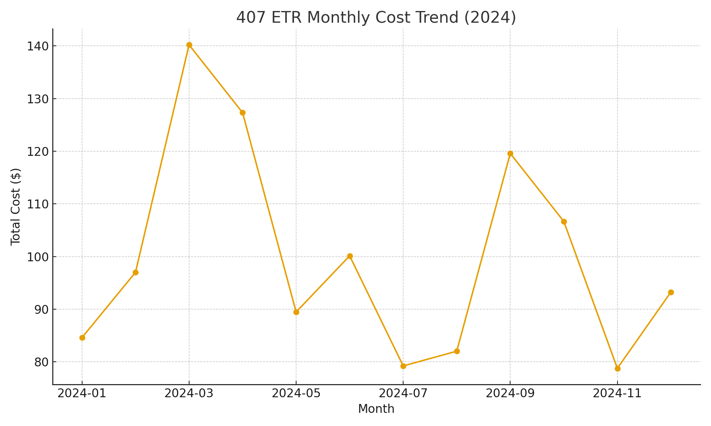

  

# 👋 Hi, I'm Kindhujan Mahendiran
Agile & Operations Project Manager • Data & Process Analytics

---

## ✈️ Air Canada — 5-Point Baggage Scanning (2022–2025)
Real-time baggage visibility via five scan touchpoints integrated into the mobile app.

  
  

  <a href="https://github.com/Kindhu-Analytics/air-canada-baggage-tracking-5point"><b> Open project → </b></a>

---

## 🎨 Data & Analytics Portfolio

<table>
  <tr>
    <td width="50%" valign="top">
      
      <h3>📊 Toronto 311 Dashboard</h3>
      

        Visualizing <b>service request patterns</b> by district to uncover workload trends and <b>SLA performance</b>.
      

      <ul>
        <li>Avg response: <b>~2.8 days</b></li>
        <li>Within SLA (≤3 days): <b>~83%</b></li>
        <li>Top district: <b>Scarborough</b></li>
      </ul>
      
<a href="https://github.com/Kindhu-Analytics/toronto-311-dashboard">Open project →</a>

    </td>
    <td width="50%" valign="top">
      
      <h3>🚗 407 ETR Cost Tracker</h3>
      

        Mapping <b>usage spikes</b> and <b>toll costs</b> over time to forecast commute spending and optimize routes.
      

      <ul>
        <li>Avg cost/trip: <b>$8.40</b></li>
        <li>Cost per km: <b>$0.21</b></li>
        <li>Avg monthly spend: <b>$172</b></li>
      </ul>
      
<a href="https://github.com/Kindhu-Analytics/407-etr-cost-tracker">Open project →</a>

    </td>
  </tr>
</table>

---

## 🔗 Links
- Portfolio: https://mkindhu47.wixsite.com/momentumiq
- Location: Toronto, ON
