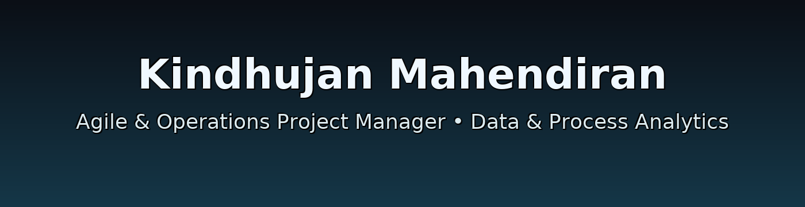
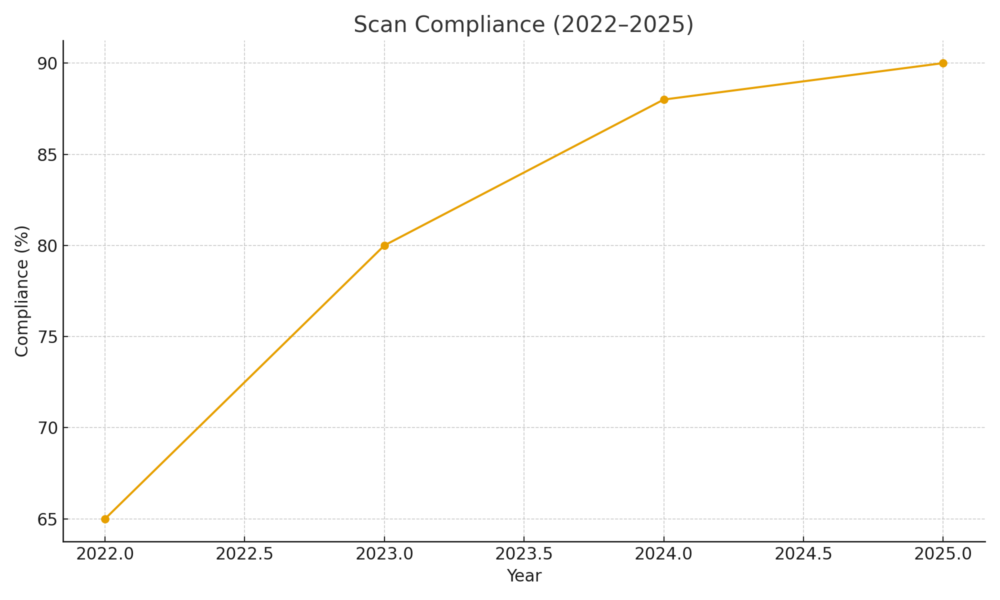
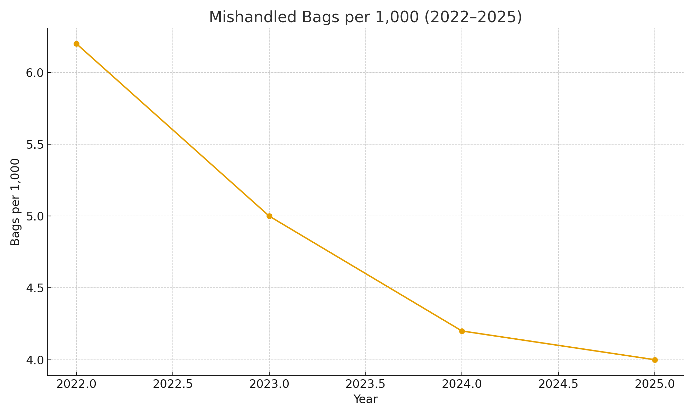

  

# 👋 Hi, I'm Kindhujan Mahendiran  

### 🚀 Agile & Operations Project Manager | Data & Process Analytics Enthusiast  

---

## ✈️ Air Canada 5-Point Scanning Project
**Goal:** Real-time baggage visibility with 5 scan touchpoints integrated into the Air Canada mobile app.  
**Highlights:**  
- Scan compliance improved from **65 % → 90 %**  
- Mishandled-bag rate reduced by **30 %**  

  
  

[➡️ View Full Case Study](https://github.com/Kindhu-Analytics/air-canada-baggage-tracking-5point)

---

## 📊 Other Projects  

### [Initial Repository](https://github.com/Kindhu-Analytics/Initial-Repository)
🗂️ SQL, Tableau & data-driven dashboards for logistics and service pattern insights.  
Projects: **Toronto 311 Dashboard**, **407 ETR Cost Tracker**

---

### [Agile Project Performance Dashboard](https://github.com/Kindhu-Analytics/agile-project-performance-dashboard)
📈 Velocity, capacity, and throughput analytics for Agile teams.  
Tools: **Power BI**, **Python**, **Excel**

---

### [Operations Process Automation Case Study](https://github.com/Kindhu-Analytics/ops-process-automation-case-study)
⚙️ Automating daily ops reporting using Python — 90 % less manual work.  

---

## 🧠 About Me  
📍 Toronto, ON  •  💼 Air Canada  
🔗 [Portfolio Website](https://mkindhu47.wixsite.com/momentumiq)
